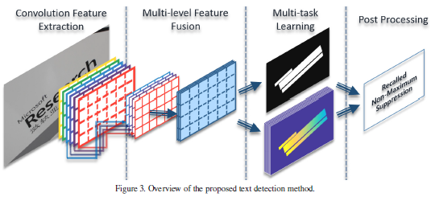
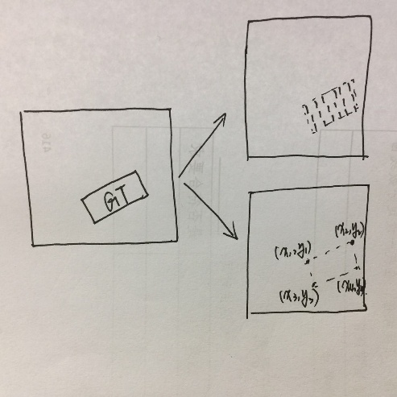
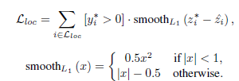
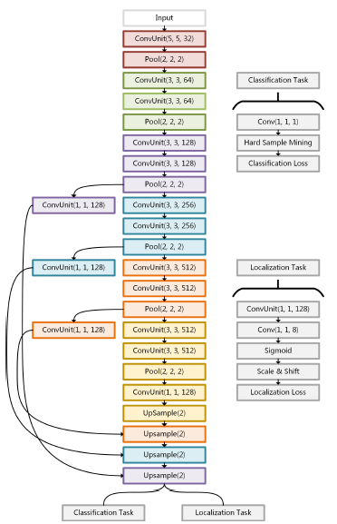
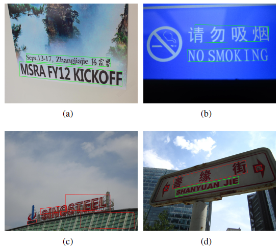

**论文** **Deep Direct Regression for Multi-Oriented Scence Text Detection浅析**

原文：[*https://arxiv.org/abs/1703.08289v1*](https://arxiv.org/abs/1703.08289v1)

文章提出了一种高效的（文本/物体）检测方法，区别于传统的直接和间接回归检测。文中提出的方法是用全卷积网络实现端对端的结构，针对点像素做二分类（是文本/非文本），然后直接回归BoundingBox的顶点坐标。

**传统方法：**

直接回归一般是预测与一个已知点（如中心点，等）的偏移，间接回归则是预测与BBox坐标的偏移。对比近期的faster rcnn和SSD算法，再针对多角度倾斜的场景文本检测，认为直接回归的方法更胜一筹，因为间接回归检测对多角度文本的检测效果较差。基于一般直接回归的概念，本文提出一种深度直接回归办法。与现存方法的对比分析:

（1）目前很少有算法可以直接生成词汇级别和行级别的区域检测（在多角度文本的情况下），大部分算法都是提供预测字符级别的区域检测，再连接各部分区域，形成整体文本的检测。

（2）另外，Faster RCNN在文本区域检测中不一定是一种高效的方法。因为一般物体检测的矩形框我们要考虑给定长宽比和各检测框之间的重叠率。但是针对多角度的文本检测时，文本的长度不可预估（超出特定长宽比是常见现象）。

(3)文本检测会让一般的适用于物体检测的系统效果不佳，因为比如水平方向的文本检测为实例，不同与一般物体，水平场景文本有更大的尺度参数和长宽比，需要对检测对象有更多复杂设计。

在这篇文章中，作者提出的检测系统有四大组成部分：

（1）卷积特征提取

（2）多级特征融合

（3）多任务学习：分类任务和回归任务

（4）NMS

**网络结构：**

**第一部分 --- 卷积特征提取：**

最大感受野要大于原图大小S，这样在回归任务阶段看到长文本串，也可提高检测预测的准确度。

**第二部分 --- 特征融合**

**第三部分 --- 分类任务：**分类是为了鉴别每个区域是否包含文本，作为二分类问题，当输入图像大小为S\*S的时候，分类任务层的输出是[]{#OLE_LINK1 .anchor}$M_{\text{cls}}$,输出结果的尺寸为(S/4)\*(S/4),这可以作为下采样，分割出包含和不包含文本的区域。

**第四部分 --- 回归任务**：上一层分类任务中得分较高的被判定为有文本的，其他则归为非文本区域，然后回归任务的输出是$M_{\text{loc}}$，输出的尺寸大小是(S/4)\*(S/4)\*8，输出八个坐标，对应的是矩形文本框的顶点坐标。（w,h,c）在回归层输出中被记为$L_{(w,h,c)}$代表着对于一个矩形框顶点坐标的偏移量，按比例放缩，还原到原图中是（4w,4h），所以矩形框$B_{(w,h)}$被表示为：

综合以上几个部分，我们针对每一个（S/4）\*(S/4)的map预测一个带分数的矩形框。

**Ground Truth和损失函数：**

{width="2.2352985564304464in" height="2.2352985564304464in"}

在多任务的情况下，损失函数由两部分组成：

$$L = \ L_{\text{cls}} + \ \lambda_{\text{loc}} \ L_{\text{loc}}$$

两部分损失值$L_{\text{cls}}$代表的是分类任务的代价，$L_{\text{loc}}$代表的是回归任务的代价，控制两个损失值平衡的是一个超参$\lambda_{\text{loc}}$。超参的存在主要是为调整分类任务和回归任务在总的损失函数中的重要性（贡献），一般取值在0.01-0.5。

分类任务的损失$L_{\text{cls}}$：

虽然分类任务中的ground truth可以被当做一个判断是否是文本的区域分割问题，但是并不是针对每一个像素点（判定是否是正样例），只是考虑哪些在文本中心线距离r范围内的像素点，标记为正样例，其他区域都是“Not Care”为负样例。这个距中心线r的范围长度跟文本框的短边成正比关系，取值为0.2。

因此文本被定义为正样例仅在它的短边为\[32/2,32/2\]。对真值的标注主要是可以减少网络特征学习中的文本和非文本的混淆。分类任务的损失函数选用hinge loss，对于任何一个给出的像素点取值为[]{#OLE_LINK2 .anchor}$y_{i}^{*} \in${0,1}，预测值为$y_{i}^{\land}$：

回归任务的损失$L_{\text{loc}}$：

考虑到回归任务的真值是很大一个范围，为了让网络在训练中快速的收敛，使用了尺度转换，转换值z是一个sigmoid神经元，意味着取值在0到1之间，把z延伸到$_{z}^{\land}\ $，

这是一种尺度转换，然后计算损失函数，

{width="3.1132075678040243in" height="1.062658573928259in"}

**数据准备：**

原始训练的输入图尺寸大小是320\*320，按照旋转角度0，π/2，π，或3π/2旋转原图得到原始训练集。

**NMS:**

在非极大值抑制算法中，重叠比例选择0.5。

**卷积网络+特征融合网络+损失层：**

**实验与结果：**

