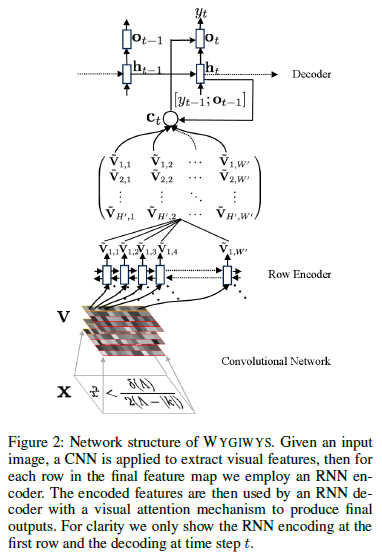
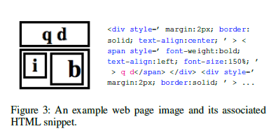
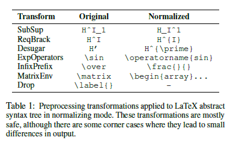
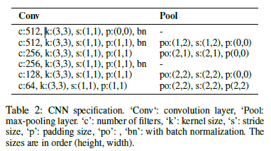
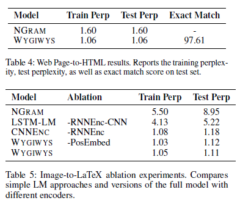
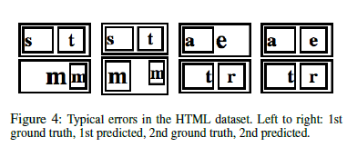
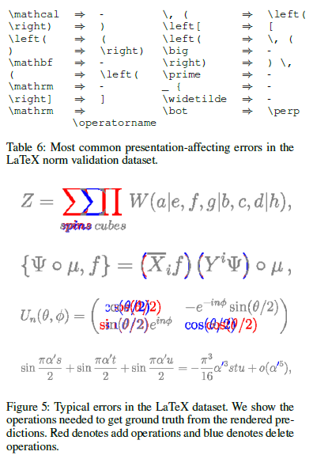

What You Get Is What You See : A Visual Markup Decompiler

译：所见即所得——视觉标记解码器

原文链接：http://xueshu.baidu.com/s?wd=paperuri%3A%2865c0553c0e788e6b64cef35f6bcc29ab%29&filter=sc_long_sign&tn=SE_xueshusource_2kduw22v&sc_vurl=http%3A%2F%2Farxiv.org%2Fabs%2F1609.04938&ie=utf-8&sc_us=12471485644436966836

基于图像字幕生成的最新进展光学字符识别（OCR），我们提出了一个通用的基于深度学习的系统，把图像反编译解码成表达标记。这项任务很好的研究了OCR中的问题，我们的方法本质上是不同的数据驱动方式的研究。我们提出的的模型不需要任何基础标记语言的知识，简单而言就是对现实世界的示例数据进行端对端的训练。该模型采用卷积网络进行文本和布局识别与基于注意的神经机器翻译一起系统。为了训练和评估模型，我们介绍一下真实数据表达式的新数据集与LaTeX标记配对，以及一个合成数据集网页与HTML片段配对。实验结果表明该系统在生成方面令人惊讶地有效两个数据集的准确标记。而一个标准的域名LaTeX OCR系统精度达到25％左右，我们的模型再现了75％的精确渲染图像例子。

**简 介**

光学字符识别（OCR）是最常用的从图像中识别自然语言。不过，

早在（Anderson 1967）的工作中，有研究将图像转换成结构化语言的兴趣或定义文本本身及其显示的标记语义。这项工作的主要重点是OCR用于数学表达式，以及如何处理表示方面如sub和superscript符号，特殊符号和嵌套分数（Belaid 和 Haton 1984，Chan和Yeung 2000）。最有效的系统结合在一起用语法进行专门的字符分割底层的数学布局语言（Miller and Viola 1998）。这个方法的一个最好的例子是INFTY用于转换印刷数学表达式的系统到LaTeX和其他标记格式（Suzuki et al 2003）。像OCR那样需要联合处理图像的问题最近看到的文字数据增加了研究兴趣由于这两个领域的深层神经模型的改进。

例如，在手写识别（Ciresan等人，2010），自然界场景OCR（Jaderberg等人，2015/2016， Wang等人2012）和图像标题生成（Karpathy和Fei-Fei 2015，Vinyals等人2015B）。在高阶中，这些系统中的每学习一个输入图像的抽象编码表示然后将其解码以产生文本输出。在除了在标准任务上执行得很好，这些模型完全是数据驱动的，这使得它们适应性强到广泛的数据集，而不需要大量的数据预处理输入或域特定工程。转向图像的数据驱动神经方法文字引导我们重新审视生成结构化的问题标记。我们考虑监督模式是否可以学习从图像中产生正确的呈现标记，而不需要文本或视觉语法底层标记语言。而语言的结果建模表明神经模型可以一致地产生语法正确的标记（Karpathy，Johnson，and 李2015 Vinyals等人2015a），不清楚是否充分解决方案可以从标记图像对中学习。我们的模型，WYGIWYS \[你得到的是你所看到的\]，是基于注意的编码器解码器的简单扩展模型（Bahdanau，Cho和Bengio 2014），现在是机器翻译标准。类似于在图像中工作标题（Xu et al。2015），该模型纳入了多层卷积网络上的图像与注意力循环神经网络解码器。去适应这个模型对OCR的问题和捕获文件的时间布局，我们还结合了一个新的源代码编码器以前应用的多行反复模型的形式应用注意。另外使用注意事项从生成的标记提供对齐到原始图像（见图1）。我们还引入了两个新的数据集，用于图像到标记任务。初步实验使用数据集的小型合成几何学HTML示例呈现为网页。对于主要实验，我们介绍一个新的数据集，IM2LATEX-100K，由大型集合组成所呈现的现实世界数学表达式从发表文章。我们会公开发表这个数据集作为工作的一部分。对相同的模型架构进行了训练，以生成HTML和LaTeX标记目标渲染到准确的源图像。实验将模型的输出与几项研究进行比较和商业基线，以及该模型的消融。 用于数学表达的完整系统一代能够匹配图像的15％以内的图像编辑距离，在超过75％的现实世界中是相同的测试示例。 另外使用多行编码器导致性能显著提高。所有数据，模型和评估脚本在[*http://lstm.seas.harvard.edu/latex/*](http://lstm.seas.harvard.edu/latex/)。

**问题：图像到标记生成**

我们将图像到标记问题定义为转换渲染源图像来充分展示目标描述的内容和布局。来源，x∈X，由具有高度H和宽度W的图像组成。RH？W用于灰度输入。目标y∈Y由a组成令牌序列y1,y2,…,yC，其中C是输出的长度，每个y是标记语言中的令牌词汇∑，渲染可以被定义为一个可能未知的多对一的编译功能，编译：y –&gt; x。实际上，该功能可能相当复杂，比如浏览器或不明确的源，例如LaTeX语言。监督任务是学习大致反转编译功能使用其行为的监督实例。我们假设我们被给予了实例（x（1）， y（1）），…， （x（J）， y（J）），具有可能不同的尺寸H; W; C，编译（y）≈ x，为所有训练对（x，y）（假设可能的噪声）。在测试的时候，系统被给予一个从真值 y 渲染的原始输入x。它产生一个假设\^ y，然后可以通过黑盒子函数\^ x =compile（\^ y）。在\^ x和x之间进行评估，即目的是产生类似的渲染图像，而\^ y可能或可能不相似于真值标记y。

**模 型**

我们的模型WYGIWYS为此任务结合了来自视觉和自然语言处理的几个标准神经元件。 它首先使用卷积神经网络（CNN）提取图像特征，并将特征排列在网格中。 然后使用循环神经网络（RNN）对每一行进行编码。 然后这些编码特征被具有视觉注意力机制的RNN解码器使用。 解码器在词汇表上实现条件语言模型，并训练整个模型以最大化观察到的标记的可能性。 完整的结构如图2所示。我们更详细地描述了模型。

**卷积网络：**

图像的视觉特征是用最大多层卷积神经网络（带最大池化层）提取出来的。 这个网络架构现在是标准的，我们在Shi.等人使用的网络之后又进行了特别建模。 （2015年）对于OCR从图像（规格在表2中给出。）与最近的OCR工作（Jaderberg等人，2015; Lee和Osindero 2016）不同，我们不使用最终完全连接的层（Ioffe和Szegedy 2015） 因为我们想保留CNN功能的局部性，以便使用视觉注意。 CNN采用原始输入R\_H\*W，并产生大小为D\*H’\*W’的特征网格V，其中c表示通道数，H’和W’是从池化层中减小的大小。

**原始编码：**

在基于注意力的图像字幕（Xu et al。2015）中，图像特征网格可以直接馈入解码器。对于OCR，馈送到解码器的视觉特征包含显著的相对顺序或信息。因此，我们试验了一个附加的RNN编码器模块，可以重新编码网格的每一行。直观地说，我们希望这种方式有效的体现在两方面：（1）许多标记语言默认为从左到右的顺序，这种顺序可以由编码器轻松学习；（2）RNN可以利用周围的水平上下文来细化隐藏的表示。

形式上来看，循序神经网络（RNN）是参数化函数RNN，将输入向量和隐藏状态递归地映射到新的隐藏状态。 在时间t，以下列方式用输入vt更新隐藏状态：ht = RNN（ht-1， vt，θ），h0是初始状态。 实际上RNN有许多不同的变体，然而，长期记忆网络（LSTM）（Hochreiter和Schmidhuber 1997）已被证明对大多数NLP任务非常有效。 为简单起见，我们将模型描述为RNN，但所有实验都使用了LSTM网络。

在该模型中，通过在该输入的每一行上运行RNN，从V创建新的特征网格V’。 递归地为所有行h∈{1，…，H’}和列w ∈{1，…，W’}，新特征定义为V’\_ h, w = RNN（V’\_ h,w-1,V\_h, w）。 为了在垂直方向上捕获顺序或信息，我们对每行使用可训练的初始隐藏状态V’ \_h,0，命名为位置嵌入（插入）。

**解码：**

然后，基于注解网格?V的序列由解码器生成目标标记令牌fytg。 解码器被训练为条件语言模型，以给出给定历史和注释的下一个令牌的概率。该语言模型被定义在解码器RNN之上，

其中W\_out是学习的线性变换，o\_t = tanh（W\_c \[h\_t; c\_t\]）。 向量h\_t用于汇总解码历史：h\_t = RNN（ht-1; \[y\_t-1;o\_t-1\]）。 下面定义的上下文矢量c\_t用于从注释网格捕获上下文信息。 在每个时间步长t，上下文向量c\_t考虑到注释网格。 然而，由于大多数注释单元可能是无关紧要的，所以模型应该知道要使用哪个单元格。 我们使用注意模型来模拟这种对齐（Bahdanau，Cho和Bengio 2014）：

其中[[]{#OLE_LINK4 .anchor}]{#OLE_LINK3 .anchor}αt是基于et计算的权重，并且权重向量ωt和所有注释向量{V’t}被组合以形成上下文向量c\_t。 注意，a和Φ有不同的选择，我们遵循过去的实证工作，并使用e\_it =βT\*tanh（Whhi-1+ WvV’t）和c\_i = ∑alpha\_it\*V\_t (Luong，Pham和Manning 2015）。 向量c\_t和h\_t结合在一起以预测令牌y\_t的概率。 图1显示了模型每个步骤αt中注意力分布的真实例子。

**训练和生成：**

完整的模型是端对端进行训练，以最大化观察到的训练数据的可能性。 除了训练数据之外，该模型还没有提供关于标记语言或生成过程的其他信息。为了从不可见的图像生成标记，我们简单地在测试时使用波束搜索，没有进一步的硬约束。

**数 据**

虽然有一些可用于图像到标记生成问题的数据集（Mouchere等人2012; 2013; Lin等人，2012），它们对于训练数据传输系统来说都太小了。 因此，我们为此任务介绍两个新的数据集：使用HTML片段的初步网页数据集，以及LaTeX中的大型现实世界数学表达式数据集。

**网 页 到 HTML**

我们的初步数据集是一个综合生成的“网页”集合，用作测试模型是否可以学习相对空间定位。 我们生成一个由100k唯一的HTML片段和相应的渲染图像组成的数据集。 图像使用Webkit编译，生成大小为100的图像。该任务是基于呈现的图像来推断HTML标记。 HTML标记是使用简单的上下文无关语法生成的。 语法递归生成每个具有实体边框，随机宽度和随机浮动（左或右）的div。 每个div可以选择性地递归地垂直或水平分割。 递归的最大深度限于div的2个嵌套层。 最后，我们对元素的宽度施加了几个约束，以避免重叠。 图3显示了从数据集中采样的示例代码段。

**LaTex数学公式**

我们的主要数据集，IM2LATEX-100K，收集了大量的真实世界用LaTeX编写数学表达式。 该数据集提供了一个更难的测试台，用于学习如何重现自然出现的标记。

**语料库**

IM2LATEX-100K数据集提供103,556种不同的LaTeX数学方程以及渲染图片。我们通过从arXiv解析LaTeX的论文来提取公式。LaTeX来源于2003年KDD杯（Gehrke，Ginsparg和Kleinberg 2003）的任务I和II，其中包含超过6万张论文。

为了从LaTex源中提取公式，我们将Latex源与简单的正则表达式匹配，即\\ begin {equation}（。\*？）\\ end {equation}，\$\$（。\*？）\$\$，\\ \[ ？）\\\]和\\（（。\*？）\\）。我们只保留字符总数从40到1024的比例，以避免单个符号，大矩阵或文本句子。通过这些设置，我们提取了超过80万种不同的LaTeX配方。在剩余的公式中，大约10万个在香草LaTex环境中呈现。使用pdflatex3实现渲染，并排除无法编译的公式。然后将渲染的PDF文件转换为PNG格式4。我们提供的最终数据集包含103,556张分辨率1654\*2339的图像与透明背景的黑色方程，以及相应的LaTeX公式。

数据集被分为训练集（83,883个方程），验证集（9,319方程）和测试集（10,354方程），用于标准化实验设置。 LaTeX配方范围从38到997个字符，平均118和中位数98。

**标记化**

训练模型需要结算一个令牌集合∑。一个选择是使用纯粹的基于字符的模型。 虽然这种方法需要较少的假设，基于字符的NMT模型的效率较低，速度较慢，而且比基于文字的模型显着更多的内存密集度。 因此，原始标记简单地分为最小有意义的LaTeX令牌，例如对于观察字符，符号如西格玛，修饰符等功能，重音符号，环境，括号和其他各种命令。

**优化：归一化**

最后，我们注意到，自然生成的LaTeX包含许多不同的表达式，产生相同的输出。 因此，我们尝试了一个可选的规范化预处理步骤，以消除虚假模糊（在训练之前）。 为了规范化，我们编写了一个LaTeX解析器，将标记转换为抽象语法树。然后，我们应用一套安全的归一化树变换来消除常见的虚假模糊度，如表1所示。注意这只会改变训练数据，并不会改变模型本身。

**实 验 设 置**

为了测试这种方法，我们将提出的模型与其他几个经典的OCR基线，神经模型和消融相比较，在HTML和LaTeX反编译任务上进行比较。

**基准线**

目前最好的基于OCR的数学表达式识别系统是InfityReader系统，它是（Suzuki等人2003）的INFTY系统的专有商业实现。该系统结合了符号识别和结构分析阶段。另外我们还尝试了开源AbiWord OCR系统，它包含了Tex生成模式（Wen 2002）。然而，我们对比发现这个系统在这个任务上执行得太差了。

对于神经模型，自然比较是标准图像字幕方法（Xu et al。2015）。由于我们的模型是基于这种方法的，所以我们通过去除编码器RNN进行比较，即用V代替V’，并且增加CNN的数量使参数的数量大致相同。我们将此模式命名为textscCNNEnc。

我们还运行了将模型与传统LM方法进行比较的实验，包括标准NGRAM模型（使用Kneser-Ney平滑训练的5克）和LSTM-LM。这表明改进有多少来自改进底层标记的语言建模。最后，对于LaTeX，我们还用完整的规范化，和简单的标记化来进行评估。

**评 估**

我们的核心评估方法是检查与真实图像x相比的渲染标记输出图像x\^的准确性。主要评估报告了黄金图像和预测图像之间的列列编辑距离。 明确地说，我们离散生成的列，并比较编辑距离序列。最终得分是使用的编辑距离操作的总数，除以数据集中的最大数量。 另外，我们检查了原始图像的精确匹配精度以及消除空白列之后的值。我们还包括标准内在文本生成度量，条件语言模型困惑度和BLEU分数（Papineni等人，2002）。请注意，这两个指标对于标记语言对具有虚假或模糊性的事实非常敏感，因此1的困惑度表示的是不可能的。

**实现细节**

相同的模型和超参数用于图像到标记任务。 CNN规范总结在表2中。该模型对所有RNN使用单层LSTM。 我们使用双向RNN作为编码器。 编码器RNN的隐藏状态大小为256，解码器RNN为512，令牌嵌入大小为80。该模型共有9.48万个参数。 我们使用小型随机梯度下降来学习参数。

初始学习率设置为0.1，一旦验证损失不减少，我们将学习率减半。 我们训练模型12个周期，并使用验证困惑来选择最佳模型。在测试阶段，我们使用光束尺寸为5的光束搜索。该系统使用Torch（Collobert，Kavukcuoglu和Farabet 2011），基于Seq2seq-attn NMT系统7.实验运行在12GB NVidia Titan X GPU上。

**HTML**

所有图像以100 \* 100颜色输入开始，然后下采样为大小为64 \* 64的灰度图像。然后我们将像素归一化到范围\[-1;1\]。在训练期间，我们只使用少于100个输入令牌的培训实例来加快培训过程。 批量大小设置为100，训练过程需要4小时。

**LaTex**

原始图像仅裁剪到公式区域，并以8像素填充到顶部，左侧，右侧和底部。 为了高效，我们将所有图像缩小到原始尺寸的一半。 为了方便批处理，我们将图像分成类似的尺寸，并使用空格填充.8在训练和验证过程中（包括在测试中），忽略所有尺寸较大的LaTeX公式，超过150个令牌或不能由我们的解析器解析的图像。 由于GPU内存的大小限制，培训批量大小设置为20。 培训过程大约需要20个小时。

**结 果**

HTML数据集的初步实验如表4所示。该模型能够达到1.06的困惑度，精确匹配精度超过97.5％。这些结果表明，该模型能够基于空间线索学习识别和生成正确的输出。剩下的困惑大部分是由于底层标记语言的含糊不清。典型的错误见表4，几个问题发生在字体大小和匹配的相对大小的div。

数学表达式的主要实验结果在表3中给出。这些结果比较了几个不同的系统对反演渲染LaTeX的任务。经典的INFTY系统在文本准确性方面能够做得很好，但在更严格的图像度量上表现不佳。我们对Imageto-Caption作品CNNENC的重新实现做得更好，把这个数字推到了50％以上。我们使用RNN编码器的完整系统将此值提高到75％以上，在此任务上实现了非常高的准确性。我们预计LaTeX归一化器可以大大提高性能，但是尽管实现了高标准化的BLEU，但是仅提供了几点精度增益。这表明解码器LM能够很好地学习，尽管现实世界中的LaTeX模糊不清。

为了更好地了解模型的每个部分的贡献，我们运行消除实验，去除不同的方面，如表5所示。最简单的模型是LaTeX上的标准NGRAM LM，其困惑度约为8.只需切换到LSTM- LM将值降低到5，这可能是由于它能够对括号和嵌套数进行计数。使用CNN添加图像数据进一步将困惑降低到1.18。添加编码器LSTM将小增益增加到1.12，但实际上在最终精度上有很大差异。添加位置嵌入（每行可训练的初始状态）增加了一个微小的增益。

模型的主要非间距误差如表6所示。这些结果显示了标准模型中最常见的显示替代。大多数的错误再次来源于字体问题，例如使用小括号而不是大括号，或使用标准数学字体，而不是转义或使用数学校准。图5显示了常见错误的几个示例。通常，表达式的大部分结构都被保留，但是具有一个或两个符号识别错误。

**总 结 与 展 望**

我们提出了一个基于视觉注意的模型，WYGIWYS，用于OCR的演示标记。该模型充当HTML和LaTeX等标记的“视觉反编译器”。我们还引入了一个新的数据集IM2LATEX-100K，它为此图像到标记生成任务提供了一个测试台。这些贡献提供了对结构化文本OCR的任务的新观点，并且显示数据驱动的模型可以令人惊讶地有效，即使没有底层语言的知识。

此工作的未来可能的方向包括：将系统扩展到完整的网站上运行或进行文档反编译，使用类似的手写数学表达方法或非正式素描中的HTML，或将这些方法与神经推理机（如MemNNs（Weston，Chopra， 和Bordes 2014），用于更复杂的标记或参考变量。
