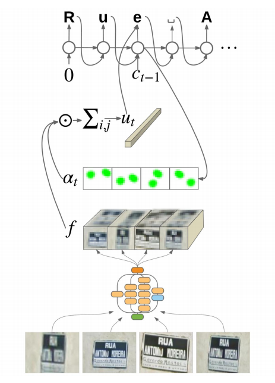

>**基于多视角特征信息的attention ocr**

[*https://github.com/tensorflow/models/tree/master/attention\_ocr*](https://github.com/tensorflow/models/tree/master/attention_ocr)

**一.训练脚本**

【从头开始训练】

	python train.py

【预训练模型，只初始化cnn部分的权重】

	python train.py --checkpoint\_inception=inception\_v3.ckpt

【预训练模型，初始化cnn和rnn全部的权重】

	python train.py --checkpoint=model.ckpt-399731

训练中的参数部分：

train.py中定义的主要参数包括：

	（1）.  max\_number\_of\_steps：最大迭代次数

	（2）.  checkpoint\_inception：加载cnn部分的权重的ckp文件路径，包括ckt的文件名

     
common\_flags.py中定义的主要参数包括：

	（1）.  batch\_size：64

	（2）.  train\_log\_dir：训练好的模型的保存路径

	（3）.  dataset\_name：训练数据的子目录名称

	（4）.  checkpoint：初始化模型所有权重（RNN和cnn两部分）的ckp文件路径，包括ckt的文件名

	（5）.  learning\_rate：学习率

	（6）.  momentum: 0.9

	（7）.  use\_attention: 解码部分是否使用注意力

	（8）.  use\_autoregression: 解码部分是否自动回归

	（9）.  num\_lstm\_units: 解码的LSTM单元的隐藏单元的个数

	（10）. weight\_decay：正则化的系数

	（11）. lstm\_state\_clip\_value：解码的LSTM单元的状态的截断值

fsns.py中定义的主要参数包括：(fsns主要定义数据集的格式)

	（1）.  charset\_filename：文字的标签文件

	（2）.  image\_shape：图片大小，默认为(150, 600, 3),

	（3）.  num\_of\_views：每个文字有多少个视角的图片，默认为4。表示一个文字有4张不同视角的图片，这些图片经过相同的CNN（Inception\_v3）模块后，所有的特征图会连接成一个特征图。比如每一张图片，经过CNN模块后，得到16\*16\*320的特征图，连接后就变成了64\*16\*320的特征图。

<!-- -->

>**二.模型结构**

1.  **模型概述**

{width="3.4776115485564305in" height="4.834191819772529in"}

上图是该方法模型的简单示意图，下面按照从下往上的顺序介绍：

1. 首先，输入是4个不同view的图片，图片中是同一个字符串，不过是从4个视角拍摄的。4这个参数就是前面提到的fsns.py中的num\_of\_views中设定的。

1. 然后，4张图片，经过相同的CNN模块，得到对应的特征图。这里的CNN模块可以为任何一种CNN结构，这里使用了Inception\_v3的结构。论文中，作者指出，他使用Inception\_v2，Inception\_v3和resnet\_ Inception\_v2三种结构实验，其中resnet\_ Inception\_v2效果最好，Inception\_v3的效果明显优于Inception\_v2。考虑到速度和精度，这里使用了Inception\_v3。

1. 接着，将4张图片经过Inception\_v3得到的特征图连接起来，连接成一个特征图，也就是上图的f。

1. 然后，将f和对应的注意力分布概率（at）进行加权求和，得到对应的中间语义，即上图的Ut。

1. 最后，解码模块为一个RNN模型，每个时刻的RNN模型的输入为前面计算的Ut，除了Ut为，每个时刻的RNN模型的输入还有还有上一时刻的输出（测试时）或者上一时刻的Groud Truth（训练时），这里用Ct-1表示，Ct-1都是one-hot编码。下面是解码RNN的计算公式：

（1）RNN在t时刻的全部输入如下：

{width="2.5in" height="0.3958333333333333in"}

（2）然后计算RNN的输出和下一个时刻的状态：

{width="2.865972222222222in" height="0.4777777777777778in"}

其中Ot和St是RNN在t时刻的输出，其中St是t时刻的状态，Ot是对应的输出，被用来计算t时刻最终的输出。

（3）计算最终的输出Ct。先将Ot 和Ut进行线性变换后，再通过softmax得到每个字符的概率，然后选择出最大概率最大的字符，即Ct。

{width="2.8881944444444443in" height="0.5222222222222223in"}

{width="1.8729166666666666in" height="0.5298611111111111in"}

下面再介绍一下注意力的计算方式，如下式：

{width="4.26875in" height="0.5597222222222222in"}

{width="2.0in" height="0.6in"}

其中，在计算注意力分布概率时，输入为t时刻解码RNN的隐藏状态St和上面的CNN输出的联合特征f。先计算tanh,然后再和Va进行点乘，接着通过softmax得到每一个序列对应的f的注意力分布概率。最后将at和f加权求和，得Ut。

**2.模型实现**

这节主要结合代码讲述上面的过程。在model.py中Create\_base()函数实现了模型的创建整个过程。主要通过4个函数完成了上面注意力编解码的过程。

(1) conv\_tower\_fn函数会创建了inception\_v3的CNN模块。

使用tensorflow.contrib.slim.nets中的inception类，调用inception.inception\_v3\_base直接创建该模块。

这里会重复执行views次，得到同一个字符串的不同视角的特征图。

(2) pool\_views\_fn 函数会将不同view的特征图水平连接起来。使用net = tf.concat(nets, 1)。

(3) sequence\_logit\_fn 函数会根据是否使用注意力和是否使用自动回归模型创建相应的解码模型。这里模型的创建是在sequence\_layers.py中实现的。

> 如果使用注意力，不使用自动回归，创建的模型类别为Attention;
>
> 如果使用注意力，也使用自动回归，创建的模型类别为AttentionWithAutoregression;

下面将会在第3部分解码模型的章节中重点介绍上面的两种解码模型。

不管哪一种模型，最后输出的结果都为{width="0.9176826334208223in" height="0.213999343832021in"}，需要（4）进一步处理，得到最后的预测字符。

(4)char\_predictions计算最后预测的字符和预测字符的置信度。将（3）的结果，先通过softmax计算出所有字符的log\_prob，然后选择prob最大对应的字符为最后预测的字符。然后计算对应预测的字符的置信度。

**3.解码模型的实现**

解码模型的定义都在sequence\_layers.py中，基础类为SequenceLayerBase，其他类别，如Attention类，是继承了SequenceLayerBase类。而AttentionWithAutoregression类，又继承了Attention类。

SequenceLayerBase类中定义了create\_logits函数，实现了解码模块。

create\_logits函数首先定义了解码模块的基础单元为LSTMCell，这个接口可以选择是否使用peepholes等LSTM的变形等。该函数中并没有使用MultiRNNCells，即解码单元为单层的LSTM结构。

接着，create\_logits函数将上面创建的LSTM的基础单元传入unroll\_cell函数，完成解码的功能。Attention类重载了unroll\_cell函数。AttentionWithAutoregression类重载了要传给unroll\_cell函数的传入参数，即get\_train\_input函数中的get\_train\_input函数和get\_eval\_input函数。

**（1）.  attention模型**

attention模型的unroll\_cell函数调用了tf.contrib.legacy\_seq2seq.attention\_decoder函数。

	def attention_decoder(decoder_inputs, initial_state, attention_states, cell, output_size=None, num_heads=1, loop_function=None, dtype=dtypes.float32, scope=None, initial_state_attention=False, attn_num_hidden=128):

其中：

>attention\_states：是前面inception\_v3输出的连接在一起的特征图，即上图的f。

>loop\_function：在训练阶段，为None，解码模块t时刻的输入值就是decoder\_inputs中对应的值。如果在测试阶段，是个可以获取前一个时刻出值的函数。用该函数获取t-1时刻的输出值，然后作为t时刻的输入值。这里统一用get\_input函数封装起来。当在训练阶段时，使用get\_train\_input函数获取，如果在测试阶段，使用get\_eval\_input函数获取。

>cell: 就是前面SequenceLayerBase类中定义的LSTMCell的解码的基础单元。

attention模型的重载了get\_train\_input函数和get\_eval\_input函数。这两个函数都是获得\_zero\_label的值。

  
attention\_decoder函数的计算过程如下：

a）运行cell，参数为decoder\_input某个时刻的值, 注意力掩码和特征图的加权和(Ut)，以及前一个时刻的状态，返回值为新序列的输出值和状态：

	x = linear([inp] + attns, input_size, True)

	cell_output, new_state = cell(x, prev_state)

b)计算新时刻的注意力掩码和注意力掩码和特征图的加权和(Ut)：

	new_at_mk = softmax(V^T* tanh(W * attention_states + U * new_state))

	new_attn = new_at_mk* attention_states

c\) 计算t时刻的输出

	output = linear([cell_output] + attns, output_size, True)

这里的output就是下面这个式子中softmax的参数。即output直接传入到softmax后，就可获得分别属于每个字母的概率。

{width="2.388059930008749in" height="0.43179133858267715in"}

**（2）.AttentionWithAutoregression模型**

AttentionWithAutoregression模型的重载了get\_train\_input函数和get\_eval\_input函数。

get\_train\_input函数直接获取\_labels\_one\_hot

get\_eval\_input函数先使用char\_logit函数将每个字符创建其对应的逻辑，然后再使用char\_one\_hot函数为每一个字符逻辑创建其对应的one-hot编码。

这里，char\_logit函数使用tf.nn.xw\_plus\_b接口为每个字符创建逻辑。即:

	self._char_logits[char_index] =tf.nn.xw_plus_b(inputs, self._softmax_w, self._softmax_b)

char\_one\_hot函数为每一个字符逻辑创建对应one-hot编码。即：

	prediction = tf.argmax(logit, dimension=1)

	slim.one_hot_encoding(prediction, self._params.num_char_classes)

AttentionWithAutoregression没有重载unroll\_cell函数，即也是调用tensorflow中的核心attention\_decoder函数。

>**三.与其他模型的比较**

**1..CRNN**

**（1）CNN模块预处理得到特征图**

输入图像高度为32，宽度不限。

假设输入的图像尺寸为32\*100的灰度图，那么cnn模块的详细结构如下：

>第一层输入的图片为【N，32，100，1】，通过64个3\*3的卷积核的卷积层（步长为1）和max pooling（2\*2），特征图变为【N，16，50，64】；

>第二层通过128个3\*3的卷积核的卷积层（步长为1）和max pooling（2\*2），特征图变为【N，8，25，128】；

>第三层通过256个3\*3的卷积核的卷积层（步长为1）和max pooling（2\*1），特征图变为【N，4，25，256】；

>第四层通过512个3\*3的卷积核的卷积层（步长为1）和max pooling（2\*1），特征图变为【N，2，25，512】；

>第五层通过512个3\*3的卷积核的卷积层（卷积核尺寸为2\*2，步长为1），特征图变为【N，1，24，512】；

从上面可以看出，CNN模块一共有7个卷积层，4个max polling层，开始的两个max polling层的kernel和stride都为（2,2），后面的两个max polling层的kernel和stride都为（2,1）。所有卷积层的kernel为3，stride为1，pad除了最后一层的卷积层没有pad外，其他所有卷积层的pad都为1。最后一层卷积层的卷积核个数为512。

所以，CNN模块的网络结构保证了图片在进入CNN网络后的宽高按照如下公式：

>输出的高 = 输入的高/16 – 1;

>输出的宽 = 输入的宽/4 – 1;

由于图像高始终为32，这里输出的高始终为1。

**（2）RNN模块，为编解码模块**

一个双向的LSTM模块单元为编码模块，编码的LSTM单元的输入数据维度为512，隐藏单元个数为256，那么输出数据维数为256。

另一个双向的LSTM模块单元为解码模块，解码的LSTM单元的输入数据包括上面编码模块的输出数据，维数为256，解码单元的隐藏单元个数为256，输出的数据维度为37，即37类中每一类的概率值。37指10个数字和26个英文字母，以及一个空格位。

**2.Attention-orc**

[*https://github.com/da03/Attention-OCR*](https://github.com/da03/Attention-OCR)

**（1）CNN模块预处理得到特征图**

输入图像高度为32，宽度不限。和上面的RCNN方法中的CNN模块结构一样。

输出为512维，图像的高为1，宽为输入的高/16 – 1;

**(2）RNN模块，为编解码模块**

一个双向的LSTM模块单元为编码模块，编码的LSTM单元的输入数据维度为512，隐藏单元个数为256，那么输出数据维数为256。这个模块和前面的RCNN一样。

另一个双层的LSTM模块单元为解码模块，解码的LSTM单元的输入数据包括上面编码模块的输出的注意力。解码单元的隐藏单元个数为128，出的数据维度为39，即39类中每一类的概率值。39指10个数字和26个英文字母，以及一个空格位，一个GO，一个EOS。

这里注意力的计算和前面讲解的attention的计算方式一样，核心也是调用tensorflow中的attention\_decoder函数。

在该方法的seq2seq.py的文件中，通过embedding\_attention\_decoder函数，实现了解码和attention两部分功能。embedding\_attention\_decoder函数的核心也是调用tensorflow中的attention\_decoder函数，实现了上述的注意力和解码功能。
